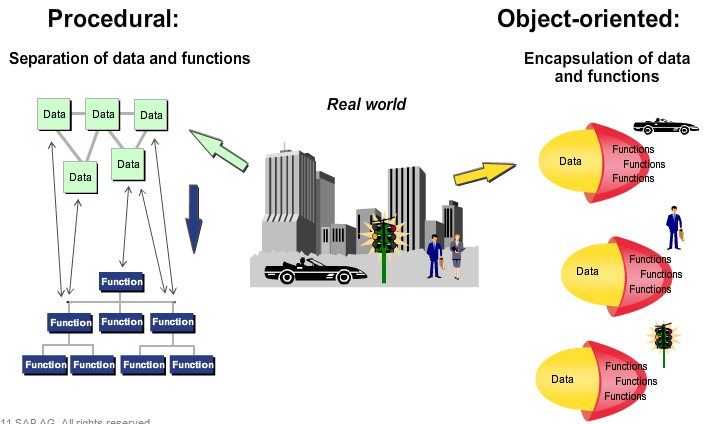
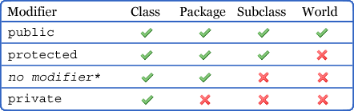

Object oriented programming is one of the popular interview question that is asked by most of the tech companies and it is fundamental concept to know if anyone is thinking of pursuing career as a developer. If you came from computer science background, OOP was probably taught during the first year of college. Not only does understanding OOP principles will help you in answering the interview questions but it will also help you to write a clean and reusable code. In this blog post, I would like to cover the principles of object oriented programming and give some code examples in Java.

## What is object oriented programming?
**Object oriented programming** or OOP is a programming paradigm in which related variables and functions are grouped together in a unit called **object**. It is important to note that objects are used to represent the real world entities. For example, we could have a cat as an object, its name and age as the variable and makeNoise() as the function. 

```java
class Cat {
    private int age;
    private String name;

    public void makeNoise() {
        System.out.println("Meow");
    }
}
```

Here, there are some important things to point out. To create the object in the first place, we need a blueprint, in our case, **class** to define what the entity is going to be like. We call **object** as an **instance** of the class and we create the object by **instantiating** the class. So we could have other class instantiating the Cat class, creating the object.

```java
class Main {
    public static void main(String args[]) {
        // Instantiating a cat class
        Cat blue = new Cat();
    }
}
```

OOP was introduced to solve the problem that **procedural programming** brought, another programming paradigm that came before object oriented programming. In procedural programming, a program is composed of bunch of data and functions (also known as procedures) and these data and functions are separated as opposed to OOP where data and functions are grouped together. It involves giving a computer a list of instructions to finish the task in step-by-step, top-down manner. <br>

<br>

The problem with procedural programming was that as the program grew and became complex, the same set of functions ended up being copied and used everywhere in a program which in turn increased inter-dependency. This led to a **spaghetti code** where a fault in one function ended up breaking other functions that depended on it. <br>

To solve the inter-dependency of functions, object oriented programming introduced concept known as **encapsulation** which hid data from direct access from outside world (more on this later). <br>

Encapsulation is just one example of the main concepts in object oriented programming. In OOP, we have four main concepts:
* Encapsulation
* Abstraction
* Inheritance
* Polymorphism

I will cover each concepts more in detail below:

## Encapsulation & Abstraction
Both of these concepts have to do with hiding the information from the outside world. For example, when we drive a car, all we have to care about is pressing on the car pedals and turning the steering wheel. The details of how the car operate is hidden from the drivers. By hiding unnecessary information from the user, interaction with the car becomes simpler since we only have to deal with its public interface. <br>

So what is difference between encapsulation and abstraction, if both of the concepts are about hiding inner implementation from user?<br>

Here is the table from [geeks for geeks](https://www.geeksforgeeks.org/difference-between-abstraction-and-encapsulation-in-java-with-examples/) page that explains the difference:

| Abstraction                                                                                   | Encapsulation                                                                                                                          |
|-----------------------------------------------------------------------------------------------|----------------------------------------------------------------------------------------------------------------------------------------|
| Abstraction is the process or method of gaining the information.                              | While encapsulation is the process or method to contain the information.                                                               |
| In abstraction, problems are solved at the design or interface level.                         | While in encapsulation, problems are solved at the implementation level.                                                               |
| ***Abstraction is the method of hiding the unwanted information.***                                 | ***Whereas encapsulation is a method to hide the data in a single entity or unit along with a method to protect information from outside.*** |
| We can implement abstraction using abstract class and interfaces.                             | Whereas encapsulation can be implemented using by access modifier i.e. private, protected and public.                                  |
| In abstraction, implementation complexities are hidden using abstract classes and interfaces. | While in encapsulation, the data is hidden using methods of getters and setters.                                                       |
| The objects that help to perform abstraction are encapsulated.                                | Whereas the objects that result in encapsulation need not be abstracted.                                                               |

Just to reiterate some of the information written in the above table, abstraction hides detail in *design level* whereas encapsulation hides detail in *implementation level*. In abstraction, we simplify/abstract away the details so that it is eaiser to interact with the object. In encapsulation, we hide internal working of class so that we can change it later without impacting the outside clients. In other words, even if we changed the internal implementation, we do not have to modify how outside clients interact with it as long as its public interface remains same.

In Java, this is achieved by the keyword `private` `protected` and `public`. We call these keywords as **access modifiers** since they help restrict the scope of a class, constructor, variable, method or data member. Each of these modifiers have different restrictions as shown below:

<br>

- **Private** variable, method, and class are only accessible on the class on which they are declared. 
- **Protected** variable, method and class are only accessible on the package it belongs.
- **Public** variable, method and class are accessible everywhere.

It is generally good practice to use *private* over *public* since using public make any change on the internal structure of class very difficult since it affects all clients using it. 


## Inheritance & Polymorphism
**Inheritance** is a mechanism in which one object acquires all the properties and behaviors of a parent object. For example, we could have vehicle as a parent class and a truck as a child class. In vehicle class, we can have a function that all of its child classes would have, such as `drive()` and all the child classes that inherits the vehicle class will have access to this function. The main advantage of this is that it reduces redunduncy in code.

When we talk about the relationship between classes, we have to consider both **inheritance** and **composition**. Inheritance is "Is a" relationship whereas composition is "has a" relationship. For example, car **is a** vehicle but car **has a** car engine. 

```java
// Composition: has-a relationship
public class Car {
    private Engine engine;
   
    public Car(){
        this.engine = new Engine();
    }
}
```

```java
// Inheritance: is-a relationship
public class Car extends Vehicle{   
    public Car(){
        
    }
}
```

So both of **inheritance** and **composition** defines a relationship between classes but when do we use one over the other? We use inheritance if we want to take advantage of **polymorphism**, but otherwise it is better to use composition. To understand this, we should know what **polymorphism** is.

In general term, we can define polymorphism as the ability of a message to be displayed in more than one form. In java, we have two types of polymorphism **method overloading** and **method overriding**.

#### Method Overloading

Method overloading is a **compile time** polymorphism and it happens when there are multiple functions with same name but different parameters. For example we could have multiple functions with name add() that takes in different number of integer or float values.

```java
class Main {
    public static void add(int a, int b) {
        System.out.println(a + b);
    }

    public static void add(int a, int b, int c) {
        System.out.println(a + b + c);
    }

    public static void add(float a, float b) {
        System.out.println(a + b);
    }

    public static void main(String args[]) {
        int a = 3;
        int b = 5;
        int c = 7;
        float d = 2.5;
        float e = 6.4;

        add(a,b);   // Calls the first add() function
        add(a,b,c); // Calls the second add() function
        add(d,e);   // Calls the third add() function
    }
}
```

#### Method Overriding

Method overriding is a **run time** polymorphism and it happens when the child class has a definition for one of the functions of the parent class. Here is the example in Java to better illustrate this:

```java
// Parent Class
class Animal{
    public void makeNoise() {
        System.out.println("Default");
    }
}

// Child Class
class Cat extends Animal{   
    @Override
    public void makeNoise() {
        System.out.println("Meow");
    }
}

class Main {
    public static void main(String[] args) {
        Animal animal = new Animal();
        Animal kitty = new Cat();

        animal.makeNoise(); // Prints "Default"
        kitty.makeNoise(); // Prints "Meow"
    }
}
```

From the print statement, we could see that the function makeNoise() from Animal class is being overridden by the Cat class. However, why and how exactly does the function from parent class gets overridden by the child class?

We should take a close look at a line of code that says `Animal kitty = new Cat()`.

On the right side of equal statement, we are creating an object of type Cat with **new** keyword. Creating an object means that Java is allocating the amount of memory the object requires to store the object.

On the left side of equal statement, we are creating a **reference variable** of type Animal called kitty. As its name suggest, reference variable is a variable that is assigned a address of the object, not the object itself.

So we have reference variable of type Animal called kitty, that points to the address of object stored in memory that is of type Cat. Having different types for reference variable and object is possible in this case because Cat class is extending from the Animal class.

What happens if reference variable kitty make the function call `kitty.makeNoise()` and which function would this method call invoke?

Java solves this in a process known as binding. **Binding** is when Java associate the method call to the appropriate method body. In the case of calling overridden function, Java uses **dynamic binding** to determine which function to call. In dynamic binding, we call the function according to the type of object in memory (ie. Cat class) instead of reference type (ie. Animal class). Since all objects are created during run time in java, dynamic binding happens during run time as the compiler does not yet know what the object is going to be like. 

Just to reiterate, function call `kitty.makeNoise()` will call the function in Cat class because of dynamic binding that associate function call to the object. This dynamic binding happens during run time since objects are only created in run time.

#### Composition vs Inheritance

Now that we understand how polymorphism work, we can discuss when we use composition over inheritance and vice versa. 

As mentioned before, we use inheritance if we want to take advantage of polymorphism. For instance, we could have classes for different types of employees such as accountant, developer and manager. We can have another class called Payroll

One of the benefits of polymorphism is that they can help make code easier to change. If we have a fragment of code that uses a variable of a parent class, the code fragment will work without change with instances of the new subclass.

Changes to the superclass's interface, however, can ripple out and break any code that uses the superclass or any of its subclasses.

## Conclusion
I originally intended to keep this blog post simpler and shorter but I realized that there are many things that I had to include if I wanted to explain how the things work the way they are. I learnt a lot while I was researching for this topic and I hope people who read it will learn from it as well!

<!--
## Abstract Class vs Interface

We can think of both abstract classes and interface as some sort of contract. Any classes that extends abstract class or implements interface would have to override any abstract methods that are defined. They give the blueprint of what the class would implement. 
-->